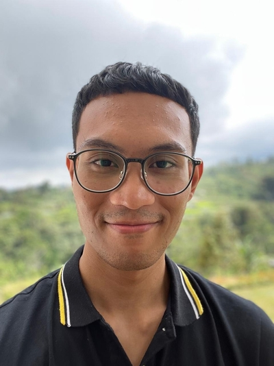

# Andika Pujangga - Responsive Personal Website

A responsive, static HTML website showcasing personal information, learning journey, and a contact form. Built using **Tailwind CSS** for streamlined styling and a fully responsive design.

---

### 📋 Project Overview
- **Name**: Andika Pujangga
- **Learning Path**: Fullstack Software Engineering at RevoU
- **Interests**: Machine Learning, AI, Fullstack Development, Automation Testing

---

### 🌐 Website Content
1. **About Me** - Introduction to my background and interests.
2. **Learning Journey** - A summary of current studies and focus areas.
3. **Contact Form** - Reach out through:
   - Name input
   - Message textarea
   - Option to subscribe to updates
   - Submit button for direct contact

---

### 🛠 Tools and Technologies
- **HTML5** for semantic structure
- **CSS3** and **Tailwind CSS** for styling
- **Responsive Design** with Tailwind’s media utilities
- **Flexbox** for flexible and effective layout positioning

---

### 🚀 How to Use
To customize this site:
1. Edit the `index.html` file for content changes.
2. Adjust styles or themes in `styles.css`.

### 📤 Deployment
The website is live on [Netlify](https://module-1-andikasafri.netlify.app).

---

Feel free to explore, and check out my [GitHub profile](https://github.com/andikasafri) for more projects and insights!
