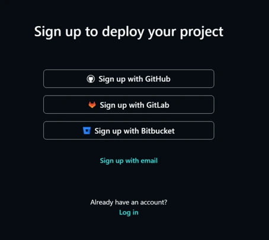
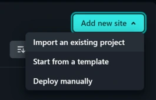
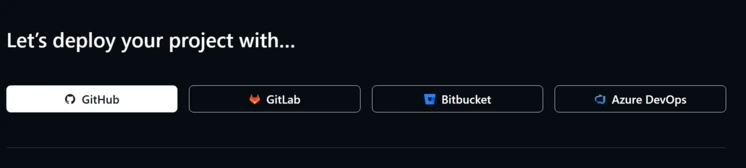
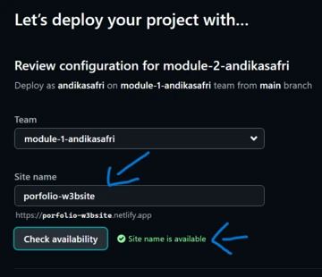
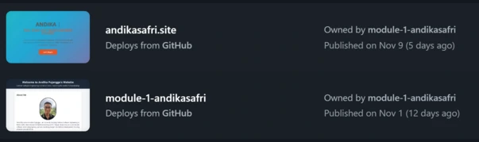
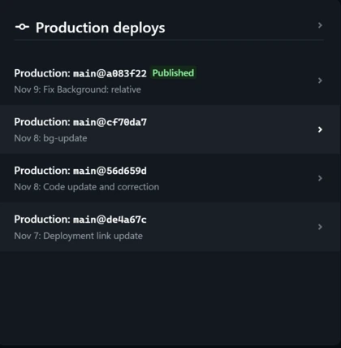
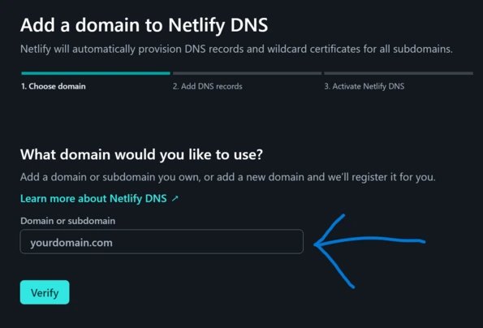
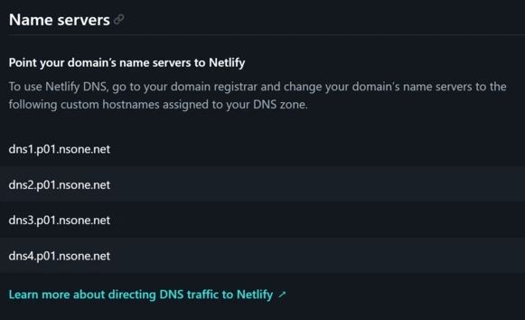
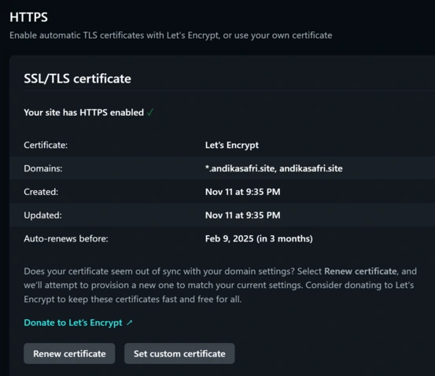

# Deployment Guide: Netlify & GitHub

This guide explains how to deploy a GitHub project on Netlify, set up auto-deployment, and connect a custom domain.

---

### 1. Netlify Setup & GitHub Connection

1. **Sign Up/Login**  
   Go to [Netlify](https://www.netlify.com), sign up or log in.

   

2. **Add New Site**  
   Go to the **Sites** page, click **"Add new site"** > **"Import an existing project"**.

   

3. **Connect to GitHub**  
   Choose **GitHub** as the source, authorize Netlify to access your repos, and select your repository (e.g., `module-2-andikasafri`).

   

4. **Configure & Deploy**  
   Adjust build settings if needed (Netlify auto-detects many settings) and click **Deploy**.

   

5. **Verify Deployment**  
   Visit the Netlify-generated URL (e.g., `your-site-name.netlify.app`) to confirm your site is live.

---

### 2. Auto-Deployment from GitHub

1. **Automatic Deployment**  
   Netlify enables auto-deployment from GitHub by default. Any main branch changes will automatically redeploy your site.

   

2. **Test Auto-Deployment**  
   Make a change in GitHub (e.g., edit README), commit to main, and check Netlify deploy logs to confirm updates.

   

---

### 3. Custom Domain & DNS Setup

1. **Buy a Domain**  
   Purchase a custom domain from a provider like NiagaHoster.

2. **Add Domain in Netlify**  
   In **Domain Settings**, click **Add custom domain** and enter your purchased domain name.

   

3. **Update Nameservers**  
   In your domain provider’s settings, replace the default nameservers with Netlify’s (found in **Domain Management** on Netlify).

   

4. **Enable SSL/TLS**  
   In Netlify’s domain settings, activate SSL/TLS for HTTPS.

   

---

### Summary

Now your project is live on Netlify, set to auto-update with GitHub, and accessible via your custom domain with SSL security.

---
