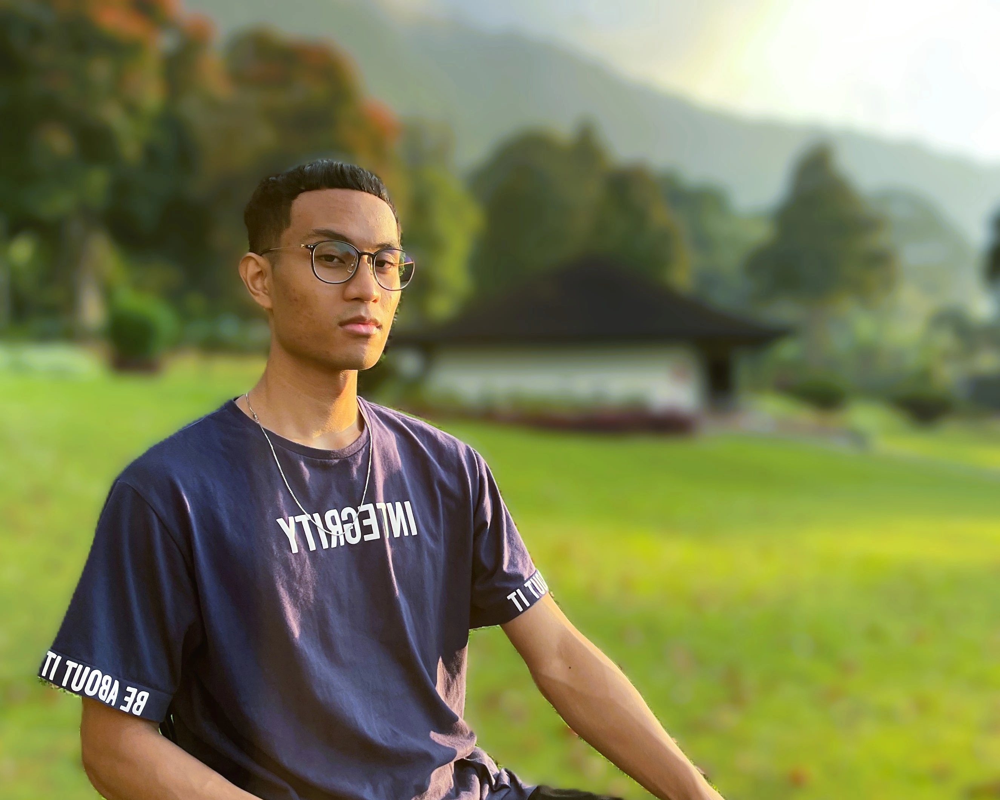

# Andika Safri - Automation Tester & Full Stack Engineer Portfolio


A responsive, dynamic portfolio website showcasing my professional experience, skills, and projects. Built with HTML, CSS, and JavaScript, featuring smooth scrolling and animated sections.

---

### 👨‍💻 About Me

I'm Andika Safri, a professional **Automation Tester** and **Front-End Developer** specializing in creating modern and responsive designs for Web and Mobile. Currently pursuing Full Stack Software Engineering to expand my skill set.

---

### 🚀 Website Sections

1. **Home** - Introduction and professional summary
2. **Work Experience** - Detailed work history and technical skills
3. **Portfolio** - Showcase of key projects
4. **Resume** - Professional profile and skills overview
5. **Skills & Technologies** - Comprehensive list of technical competencies
6. **About** - Personal background and career aspirations
7. **Social** - Professional networking links
8. **Contact** - Form to get in touch

---

### 💼 Featured Work Experience

- **End-to-End Automation Tester** at Apicore GmbH (June 2022 - August 2024)
  - Enhanced CI/CD with Cypress-based end-to-end tests
  - Reduced testing cycle time by 15%
  - Improved load times by 10%

---

### 🛠 Skills & Technologies

- **Frontend**: HTML5, CSS3, JavaScript, React, Tailwind
- **Testing**: Cypress, Jest, Selenium, TestNG
- **Tools**: Git, Docker, AWS, Jenkins
- **Specialized in**: Cypress (End-to-End Testing)

---

### 🌐 Projects

1. **Personal Website** - Responsive HTML site with Tailwind CSS
2. **E2E Testing Implementation** - Cypress tests in CI/CD
3. **Stripe Payment Integration** - Website with integrated payment processing

---

### 🖋 Assignment Implementation Summary

This section covers all assignment tasks, demonstrating the implementation of various required features:

- **Font Implementation**: Custom `@font-face` font applied to the `body` element for consistent usability across the site.
- **Text Styling**: `text-shadow` applied to `.title` and `.work-wrapper h3` for subtle, polished effects.
- **Custom List Styles**: Unique list styles created using emojis with the `::before` pseudo-element on various `ul` lists.
- **Responsive Background Image**:
  - Uses the `<picture>` element with multiple `<source>` tags and `srcset` attributes to serve optimized images based on screen width.
  - Includes fallback `` for compatibility with older browsers.
  - `object-fit: cover` ensures aspect ratio maintenance.
  - Example:
    ```html
    <picture class="background-image">
      <source
        media="(max-width: 767px)"
        srcset="../images/about-bg-small.webp"
      />
      <source
        media="(max-width: 1199px)"
        srcset="../images/about-bg-medium.webp"
      />
      <source
        media="(min-width: 1200px)"
        srcset="../images/about-bg-large.webp"
      />
      
    </picture>
    ```
- **Asymmetrical Grid Layout**: Uses CSS Grid for an asymmetrical layout in the work experience section, with media queries for responsiveness.
- **CSS Transitions**:
  - Example: `.tm-view-more-btn` with `transition: all 0.6s ease-in;`
- **CSS Animations**:
  - Example: `@keyframes slideInFromLeft` to create a slide-in effect:
    ```css
    @keyframes slideInFromLeft {
      0% {
        transform: translateX(-100%);
        opacity: 0;
      }
      100% {
        transform: translateX(0);
        opacity: 1;
      }
    }
    ```

---

### 📞 Contact

To get in touch:

- Fill out the contact form on the website
- Connect on [LinkedIn](https://www.linkedin.com/in/andika-safri)
- Check out my code on [GitHub](https://github.com/andikasafri)
- Follow my dev journey on [Daily.dev](https://app.daily.dev/andikasafri)

---

### 🚀 How to Use

To run this website locally:

1. Clone the repository
2. Open `index.html` in your browser

### 📤 Deployment

The website is live at [Portfolio Website](https://module-2-andikasafri.netlify.app).

---

Feel free to explore my portfolio and reach out for collaborations or opportunities!
